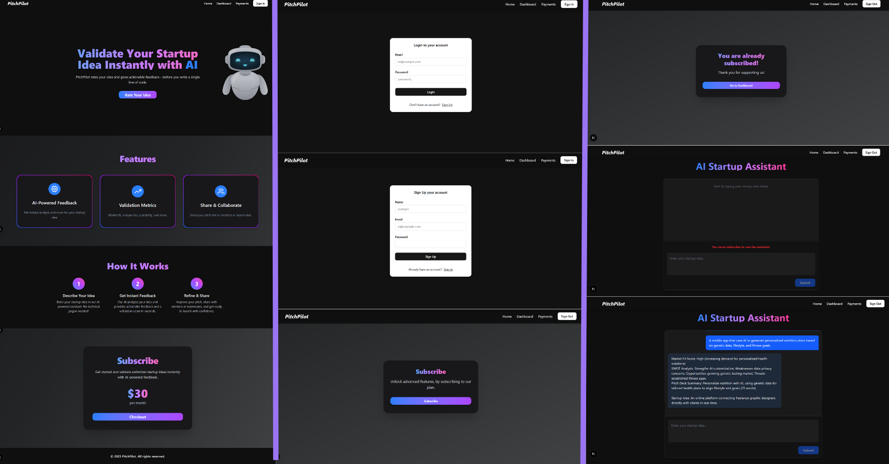

# 🚀 PitchPilot

**PitchPilot** is an AI-powered web application that helps entrepreneurs and founders **validate their startup ideas**. Just enter your idea, and PitchPilot will instantly generate a:

- ✅ **Market fit score**
- ✅ **SWOT analysis**
- ✅ **Pitch deck outline**

This tool helps you move from raw idea to investor-ready pitch material in minutes.

---

## 🌟 Features

- 🧠 AI-generated startup validation using **Ollama**
- 📊 Real-time **market fit scoring**
- 📋 Auto-generated **SWOT analysis**
- 🎯 Investor-style **pitch deck outlines**
- 🧑‍💼 Supabase authentication & user dashboard
- 💳 Stripe billing
- 💾 Save and manage past ideas (coming soon)

---

## ⚙️ Tech Stack

| Area | Tech |
|------|------|
| **Frontend** | Next.js (App Router), TypeScript |
| **Styling** | Tailwind CSS, shadcn/ui |
| **AI Engine** | Ollama (LLM-based idea evaluation) |
| **Backend / DB** | Supabase (auth + database) |
| **State Management** | React Context API |
| **Payments** | Stripe integration |
| **Hosting** | Vercel (recommended) |

---

## 🧠 How It Works

1. User submits a startup idea (name + description)
2. The app uses **Ollama** (LLM) to:
   - Analyze product-market fit
   - Generate SWOT analysis
   - Create a pitch deck outline
3. Users receive the results in a clean, shareable UI
4. Premium users (via **Stripe**) can unlock the AI features

---
